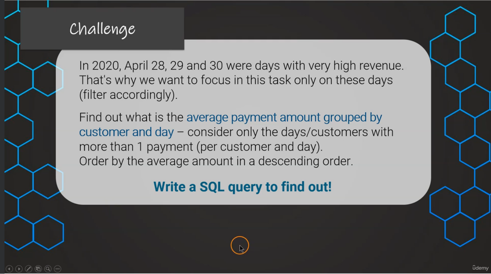

## SQL Solution for Day 3 Challenges



```sql
SELECT
DATE(payment_date),
customer_id,
ROUND(AVG(amount),1) AS average,
COUNT(*)
FROM payment
WHERE DATE(payment_date) IN ('2020-4-30', '2020-4-29', '2020-4-28')
GROUP BY customer_id, DATE(payment_date)
HAVING COUNT(amount) > 1
ORDER BY average DESC

--Answer: Customer 459 had an average payment amount of 10.5 on 2020-04-29
